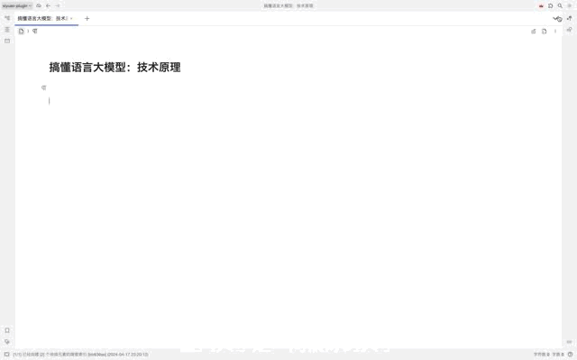
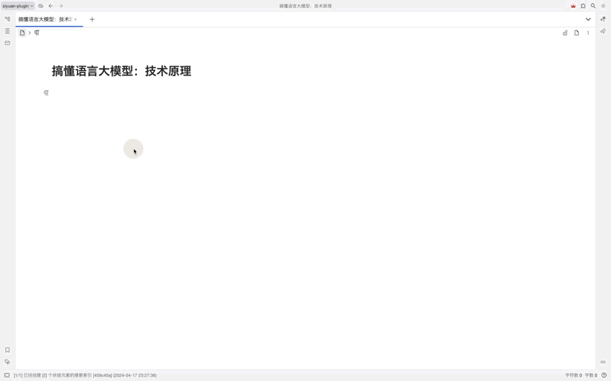
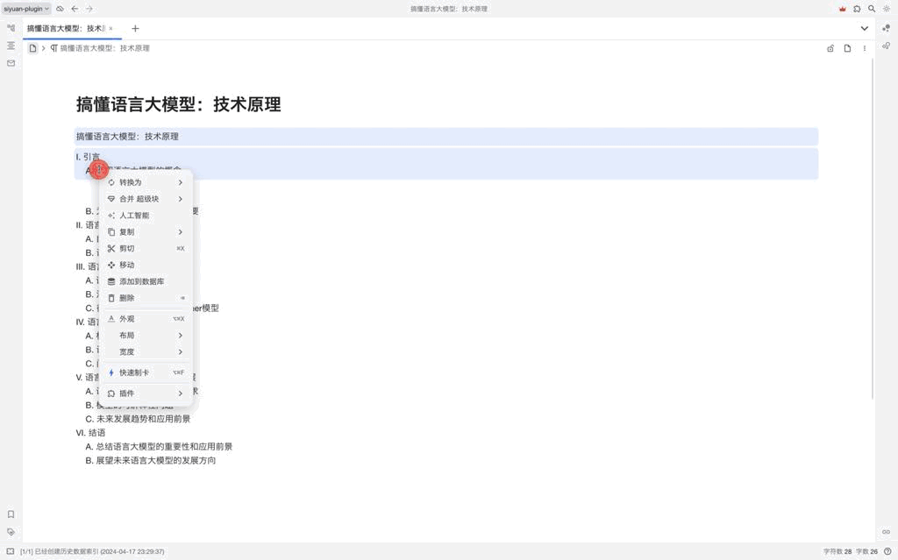

# 思源笔记人工智能插件

缘起：思源笔记自带的人工智能目前只支持OpenAI的大模型，没有适配谷歌大模型Gemini、Claude3、Qwen、文心等模型。考虑到思源开发者的重心放在开发和维护思源笔记上。所以在工作之余的休息时间，开发了这款插件。

## 科普GPT-4和GPT-3.5

| 模型 | 描述                                                   |
| ------ | -------------------------------------------------------- |
| [GPT-4](https://platform.openai.com/docs/models/gpt-4)     | 改进 GPT-3.5 的模型，可以理解和生成自然语言或代码      |
| [GPT-3.5](https://platform.openai.com/docs/models/gpt-3-5)     | 改进 GPT-3 的模型，可以理解并生成自然语言或代码        |
| [DALL·E](https://platform.openai.com/docs/models/dall-e)     | 可以在给定自然语言提示的情况下生成和编辑图像的模型     |
| [Whisper](https://platform.openai.com/docs/models/whisper)     | 可以将音频转换为文本的模型                             |
| [Embeddings](https://platform.openai.com/docs/models/embeddings)     | 一组可以将文本转换为数字形式的模型                     |
| [Codex](https://platform.openai.com/docs/models/codex)     | 一组可以理解和生成代码的模型，包括将自然语言转换为代码 |
| [Moderation](https://platform.openai.com/docs/models/moderation)     | 可以检测文本是否敏感或不安全的微调模型                 |
| [GPT-3](https://platform.openai.com/docs/models/gpt-3)     | 一组可以理解和生成自然语言的模型                       |

### GPT-4

GPT-4 是一个大型多模态模型（接受文本输入和生成文本输出，将来会有图像输入），由于其更通用的知识和高级推理能力，是OpenAI当前最优秀的模型。与 `gpt-3.5-turbo` 一样，GPT-4 针对聊天和文本生成进行了优化迭代。

| MODEL          | 描述                                                | 最大 tokens 数   |
| ---------------- | ----------------------------------------------------- | ------------------ |
| gpt-4          | 比任何 GPT-3.5 模型都更强大，能够执行更复杂的任务。 | 8,192 个 tokens  |
| gpt-4-0613     | 2023 `gpt-4` 年 6 月 13 日的快照，包含函数调用数据。       | 8,192 个 tokens  |
| gpt-4-32k      | 与基本`gpt-4`模式相同的功能，但上下文长度是其 4 倍。       | 32,768 个 tokens |
| gpt-4-32k-0613 | 2023 `gpt-4-32` 年 6 月 13 日的快照。                         | 32,768 个 tokens |

### GPT-3.5

GPT-3.5 模型可以理解和生成自然语言或代码。在 GPT-3.5 系列中功能最强大的型号是`gpt-3.5-turbo`，它针对聊天进行了优化，也适用于传统的文本生成任务。

| MODEL                  | 描述                                                | 最大 tokens 数 |
| ------------------------ | ----------------------------------------------------- | ---------------- |
| gpt-3.5-turbo          | 功能最强大的 GPT-3.5 型号                           | 4096 tokens    |
| gpt-3.5-turbo-16k      | 与标准模型`gpt-3.5-turbo`有相同的功能，但该模型是其 4 倍的上下文。 | 16,384 tokens  |
| gpt-3.5-turbo-0613     | 2023 `gpt-3.5-turbo` 年 6 月 13 日的快照，包含函数调用数据。       | 4096 tokens    |
| gpt-3.5-turbo-16k-0613 | 2023 `gpt-3.5-turbo-16k` 年 6 月 13 日的快照。                         | 16,384 tokens  |

### 模型及价格
> token和单词/汉字的关系：通常情况下1~2个token 对应一个英文单词，2~3个token对应一个中文汉字。

| 模型                      | 官方提问价格(美元) | 官方回答价格(美元) |
| --------------------------- | -------------------- | -------------------- |
| gpt-3.5-turbo             | $ 0.0015 /1k       | $ 0.002 /1k        |
| gpt-3.5-turbo-0125        | $ 0.0005 /1k       | $ 0.0015 /1k       |
| gpt-3.5-turbo-0301        | $ 0.0015 /1k       | $ 0.002 /1k        |
| gpt-3.5-turbo-0613        | $ 0.0015 /1k       | $ 0.002 /1k        |
| gpt-3.5-turbo-1106        | $ 0.001 /1k        | $ 0.002 /1k        |
| gpt-3.5-turbo-16k         | $ 0.003 /1k        | $ 0.004 /1k        |
| gpt-3.5-turbo-16k-0613    | $ 0.003 /1k        | $ 0.004 /1k        |
| gpt-4                     | $ 0.03 /1k         | $ 0.06 /1k         |
| gpt-4-0125-preview        | $ 0.01 /1k         | $ 0.03 /1k         |
| gpt-4-0314                | $ 0.03 /1k         | $ 0.06 /1k         |
| gpt-4-0613                | $ 0.03 /1k         | $ 0.06 /1k         |
| gpt-4-1106-preview        | $ 0.01 /1k         | $ 0.03 /1k         |
| gpt-4-1106-vision-preview | $ 0.01 /1k         | $ 0.03 /1k         |
| gpt-4-32k                 | $ 0.06 /1k         | $ 0.12 /1k         |
| gpt-4-32k-0314            | $ 0.06 /1k         | $ 0.12 /1k         |
| gpt-4-32k-0613            | $ 0.06 /1k         | $ 0.12 /1k         |
| gpt-4-turbo               | $ 0.01 /1k         | $ 0.03 /1k         |
| gpt-4-turbo-2024-04-09    | $ 0.01 /1k         | $ 0.03 /1k         |
| gpt-4-turbo-preview       | $ 0.01 /1k         | $ 0.03 /1k         |
| gpt-4-vision-preview      | $ 0.01 /1k         | $ 0.03 /1k         |

## 特性
- [x] 支持OpenAI的gpt-3.5和gpt-4模型；
- [x] 支持流式输出，让等待不再焦虑；
- [x] 在使用prompt时，可以调整模型、temperature等参数；
- [x] 支持自定义API BaseUrl；
- [x] 支持更多的OpenAI模型(20240419)
- [ ] 支持prompt管理：新建和保存prompt及参数，方便prompt的不断优化；
- [ ] 增加对话框聊天功能
- [ ] 搭建prompt集市：prompt的共享和交流；
- [ ] 接入claude系列模型
- [ ] 接入Gemini模型
- [ ] 支持本地知识库检索生成(RAG)
- [ ] 支持文生图功能
- [ ] 如果你有什么想法，也可以加QQ群沟通：710607849

## 配置

## 使用
### 流式输出
使用流式输出需要在设置面板处开启流式输出的开关

### 非流式输出

## 

## BUG反馈、建议
到QQ群: 710607849
或者到 Github 提交问题
## 致谢
感谢[思源笔记](https://b3log.org/siyuan/)和[思源社区](https://docs.siyuan-note.club/zh-Hans/guide/)的贡献