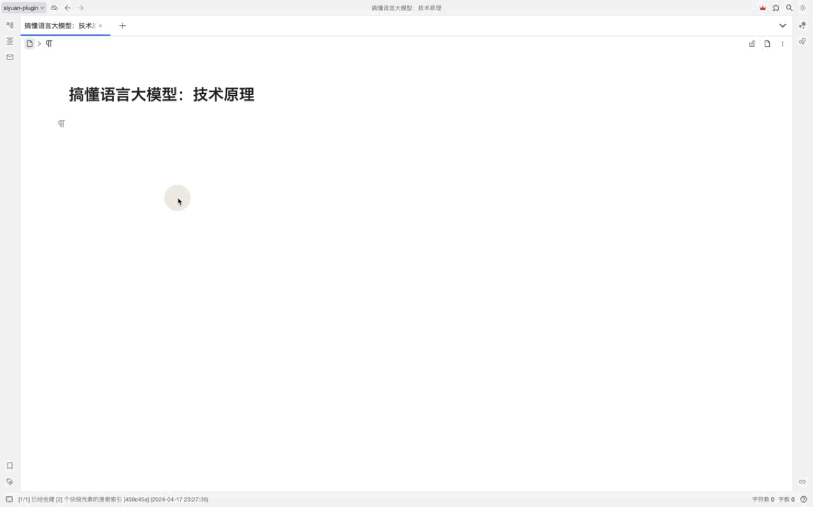
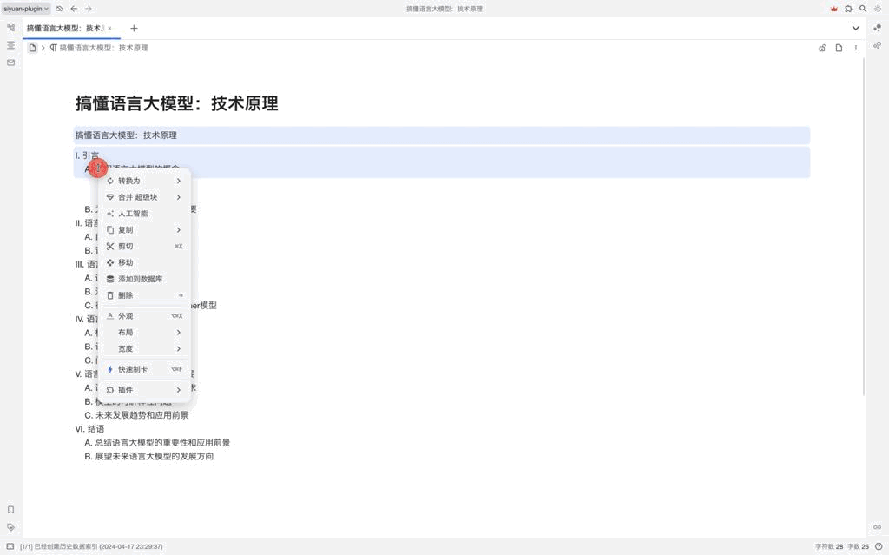

# 思源笔记人工智能插件

缘起：思源笔记自带的人工智能目前只支持OpenAI的大模型，没有适配谷歌大模型Gemini、Claude3、Qwen、文心等模型。考虑到思源开发者的重心放在开发和维护思源笔记上。所以在工作之余的休息时间，开发了这款插件。

## 特性
- [x] 支持OpenAI的gpt-3.5和gpt-4模型；
- [x] 支持流式输出，让等待不再焦虑；
- [x] 在使用prompt时，可以调整模型、temperature等参数；
- [x] 支持自定义API BaseUrl；
- [ ] 支持prompt对话框快捷键
- [ ] 支持prompt管理：新建和保存prompt及参数，方便prompt的不断优化；
- [ ] 搭建prompt集市：prompt的共享和交流；
- [ ] 接入claude系列模型
- [ ] 接入Gemini模型
- [ ] 支持本地知识库检索生成(RAG)
- [ ] 支持文生图功能
- [ ] 如果你有什么想法，也可以加QQ群沟通：710607849

## 配置

## 使用
### 流式输出
使用流式输出需要在设置面板处开启流式输出的开关

### 非流式输出

## BUG反馈、建议
到QQ群: 710607849
或者到 Github 提交问题
## 致谢
感谢[思源笔记](https://b3log.org/siyuan/)和[思源社区](https://docs.siyuan-note.club/zh-Hans/guide/)的贡献